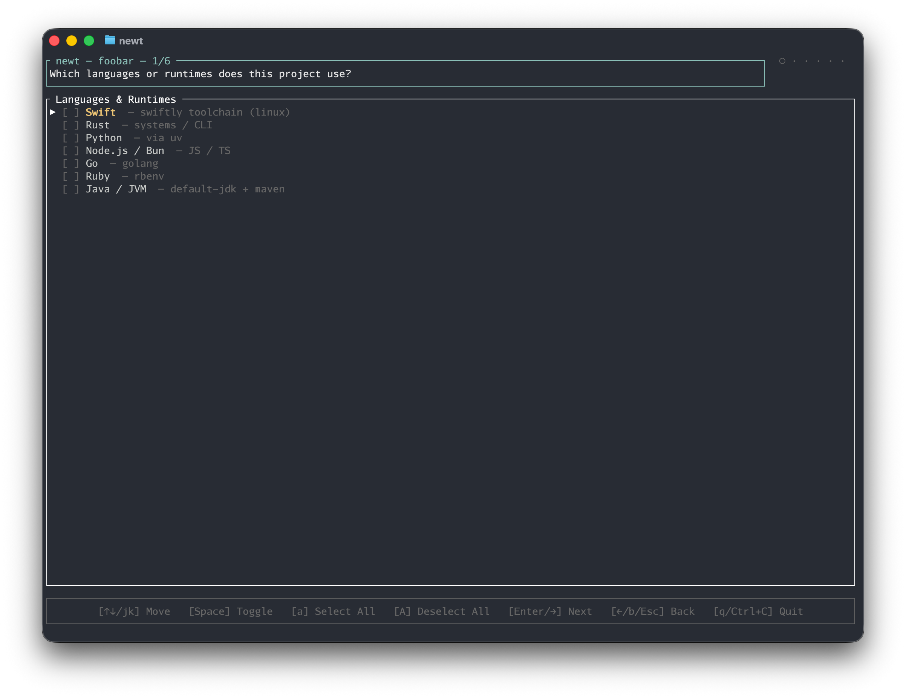

# newt (`new` projec`t`)

Terminal UI wizard for scaffolding new projects with a `.devcontainer` setup.

```
newt foobar
```

Walks you through 5 checklist screens and writes a lean, fully configured devcontainer to `foobar/`.

<p align="center">
  
</p>

## What it generates

```
foobar/
├── .devcontainer/
│   ├── devcontainer.json     # VS Code devcontainer config
│   ├── Dockerfile            # Ubuntu base + your chosen tools
│   ├── install-ai-tools.sh   # AI coding tool installer
│   ├── init-firewall.sh      # Allowlist-based outbound firewall
│   └── bashrc.sh             # Shell aliases and environment
└── .gitignore
```

## Wizard steps

| Step | Options | Pre-selected |
|------|---------|--------------|
| Languages | Swift, Rust, Python, Node.js/Bun, Go, Ruby, Java/JVM | — |
| Databases | PostgreSQL, MySQL/MariaDB, SQLite, Redis, MongoDB | — |
| AI tools | Claude Code, pi, GitHub Copilot, OpenCode | Claude Code |
| Extra CLI | ripgrep, fd-find, jq, bat, htop, httpie, just, watchexec | first four |
| Gitignore | .env, .env.local, *.log, .DS_Store, temp files, dist/build/ | first six |

Selecting a language auto-selects its relevant gitignore patterns (e.g. Rust → `target/`, Python → `.venv/`, Node → `node_modules/`).

If `.devcontainer/` or `.gitignore` already exist, you'll be prompted before anything is overwritten.

## Keys

| Key | Action |
|-----|--------|
| `↑↓` / `jk` | Move cursor |
| `Space` | Toggle item |
| `a` / `A` | Select / deselect all |
| `Enter` / `→` | Next step |
| `←` / `b` / `Esc` | Previous step |
| `q` / `Ctrl+C` | Quit |

## Install

```bash
git clone <repo-url>
cd newt
./install.sh                  # installs to ~/.local/bin
./install.sh /usr/local/bin   # or a custom path
```

Requires [Rust](https://rustup.rs) 1.70+.

## Usage

```bash
newt                          # scaffold into the current directory
newt my-project               # create my-project/ and scaffold inside it
newt my-project -o ~/projects # create ~/projects/my-project/
```

## License

MIT
